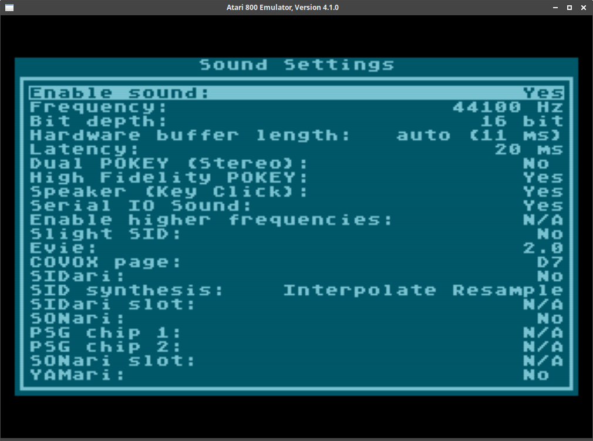
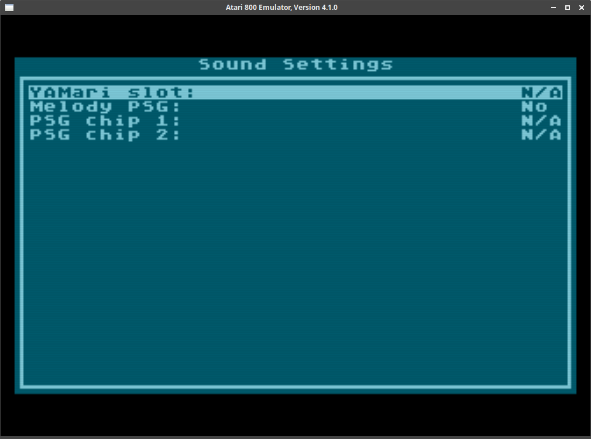

# atari800-soundbox

Atari800 SoundBox emulator based on [Atari800](https://atari800.github.io/) version 4.1.0.

Various soundcards implementations done by [Mono](http://mono.i-demo.pl/).

---

## Required libraries

### [reSID](http://www.zimmers.net/anonftp/pub/cbm/crossplatform/emulators/resid/index.html)

Download [resid-0.16.tar.gz](http://www.zimmers.net/anonftp/pub/cbm/crossplatform/emulators/resid/resid-0.16.tar.gz) or install from `libs/resid`.

```bash
$ ./configure
$ make
$ sudo make install
```

### [libayemu](https://github.com/asashnov/libayemu)

Clone linked repository or install from `libs/libayemu`.

```bash
$ ./configure
$ make
$ sudo make install
```

If you cloned linked repo please follow the instructions provided with the repository.

## Compilatioin Atari800 SoundBox

```bash
$ ./configure \
    --enable-monitorbreakpoints \
    --enable-monitorprofile \
    --enable-monitortrace \
    --enable-seriosound \
    --enable-volonlysound \
    --enable-synchronized_sound \
    --enable-sid_emulation \
    --enable-psg_emulation \
    --enable-opl3_emulation
$ make
$ sudo make install
```

or

```bash
$ ./configure-everything.sh
$ make
$ make install
```



